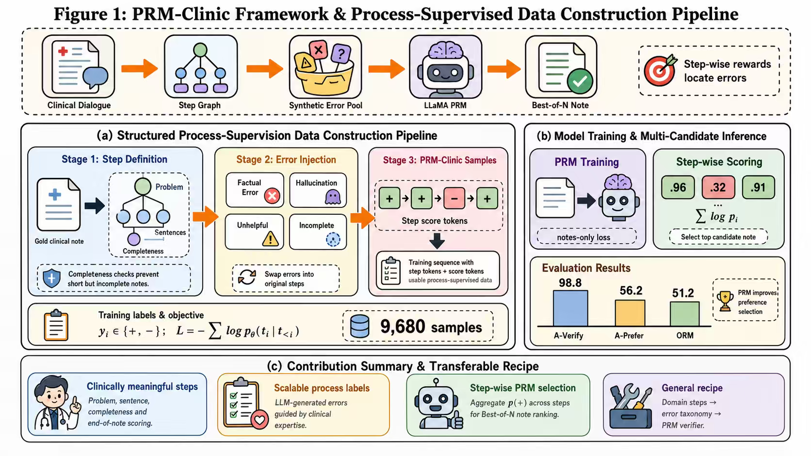
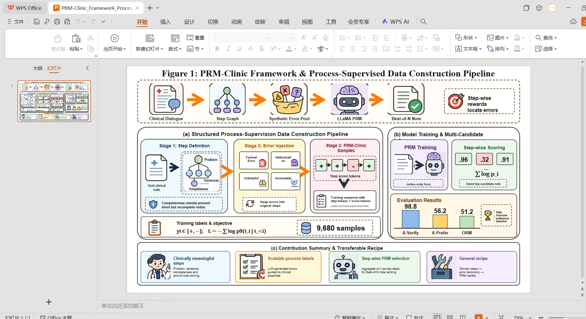
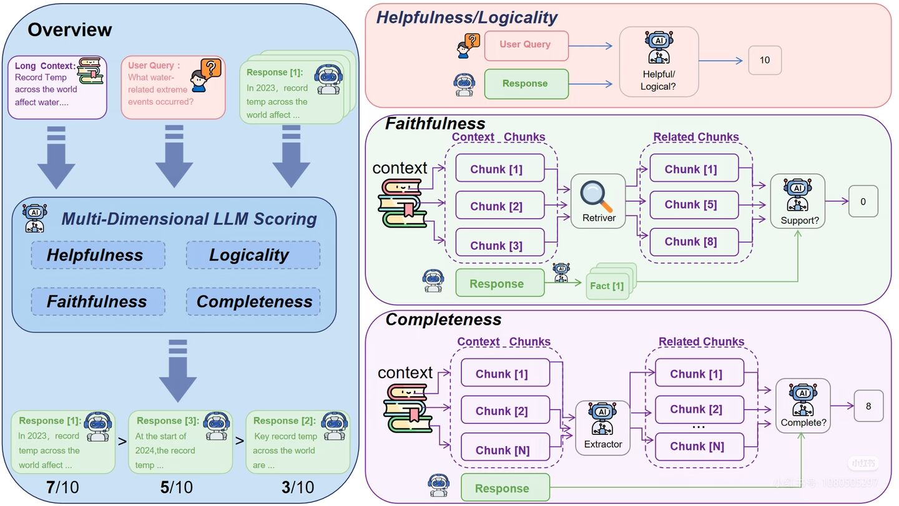
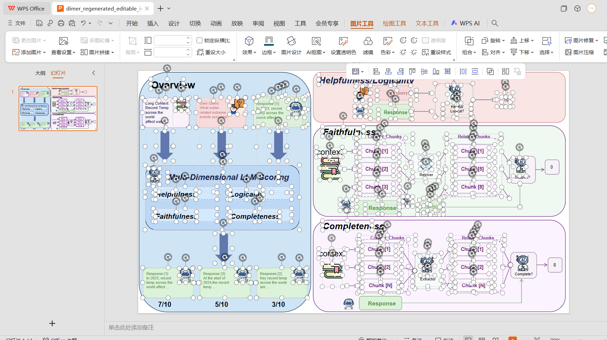
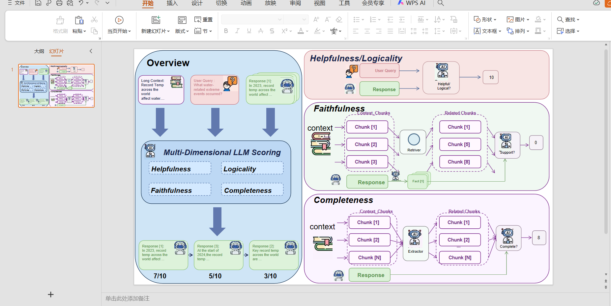

# dimer-ppt

`dimer-ppt` is a Codex skill for converting screenshots, academic figures, and dense infographic images into high-fidelity editable PowerPoint decks.

It is built for the annoying middle ground: figures that are too detailed for a quick manual redraw, but where a full-slide screenshot is not acceptable because the user needs editable text, panels, arrows, tokens, charts, and layout objects.

## What It Does

- Inspects the source image and writes a source-derived `visual_spec.md`.
- Builds an element `manifest.json` before generating the deck.
- Creates a `skeleton.pptx` first so layout drift can be caught early.
- Reconstructs panels, text, arrows, connectors, charts, tokens, and labels as native PowerPoint objects.
- Uses small raster crops only for complex icons or cartoon artwork when editable shape redrawing would reduce fidelity.
- Exports a PowerPoint-rendered preview and compares it with the source image.
- Runs QA scripts for XML stats, layout guards, visual review sheets, and region review tiles.

## Relationship To Other Skills

This public version is intended to be self-contained and clean-room.

The workflow uses common reconstruction ideas such as manifests, skeleton passes, render diffs, and layout guards. Those are general engineering patterns, not copied private skill content. Before publishing, the skill was checked against local `ppt-master` and `xiaobei-skill-image-to-vba` skill files for long-line exact duplication; no long-line exact duplication was found.

`dimer-ppt` is narrower than a general presentation-generation system: it focuses on image-to-editable-PPT reconstruction and render-based repair.

## Install

Clone this repository into your Codex skills directory:

```powershell
git clone https://github.com/dididimer/dimer-ppt.git "$env:USERPROFILE\.codex\skills\dimer-ppt"
```

Then restart or refresh Codex so the skill list reloads.

## Usage

Ask Codex to use `dimer-ppt`:

```text
请使用 dimer-ppt skill，把这张图转为可编辑 PPT，要求排版和图片一致。
```

For dense academic diagrams, the default mode is usually `hybrid-fidelity`: layout, text, arrows, charts, and panels are editable, while a few complex cartoon icons may remain as small image crops.

## Examples

### PRM-Clinic Pipeline

GPT-generated source figure:



PowerPoint/WPS result after `dimer-ppt` reconstruction:



### Multi-Dimensional LLM Scoring

GPT-generated source figure:



Editable PPT objects selected in WPS:



Rendered PPT/WPS result:



## Limitations

- It can be slow. Codex may spend a long time inspecting, generating, rendering, checking, and repairing a dense slide.
- Very dense figures may still differ from the original in small details such as icon micro-text, exact line spacing, border radius, or tiny alignment offsets.
- Hybrid-fidelity mode may preserve small raster crops for complex illustrations. This improves visual fidelity, but those cropped icons are not fully editable.
- Exact typography depends on local fonts and PowerPoint/WPS rendering behavior.
- Render-based QA works best on Windows with PowerPoint automation available. If render export is blocked, the result should be treated as a draft until the user opens and verifies it.
- This is not a magic OCR/layout engine. For difficult screenshots, the best result often comes from several local repair passes.

## Expected Artifacts

A complete run normally produces:

- `visual_spec.md`
- `manifest.json`
- `skeleton.pptx`
- `skeleton_preview.png`
- `styled.pptx`
- `styled_preview.png`
- `source_render_review_sheet.png`
- `layout_guard.json` or `layout_guard_windows.json`
- region review tiles

## Notes

- PowerPoint may briefly open and close during generation or validation. That is expected: the skill uses PowerPoint as the rendering and layout engine.
- A full-slide source image should not be used as the final answer unless the user explicitly requests a reference-overlay slide.
- If you publish modified versions of this skill, avoid copying private skill text, examples, or scripts whose license is unclear.

