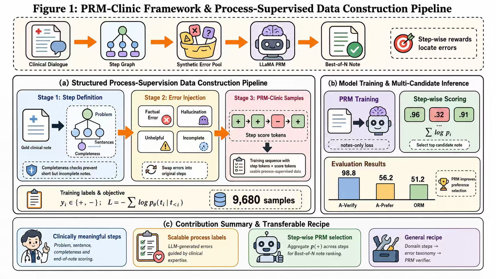
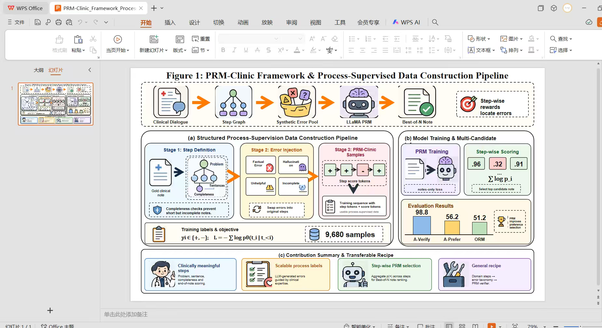
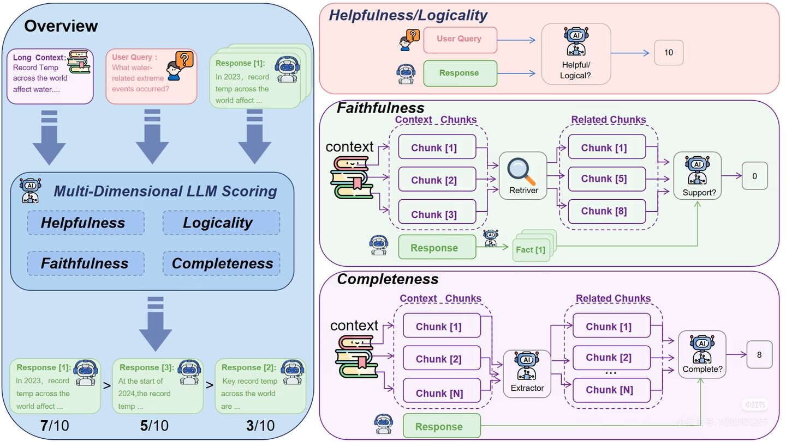
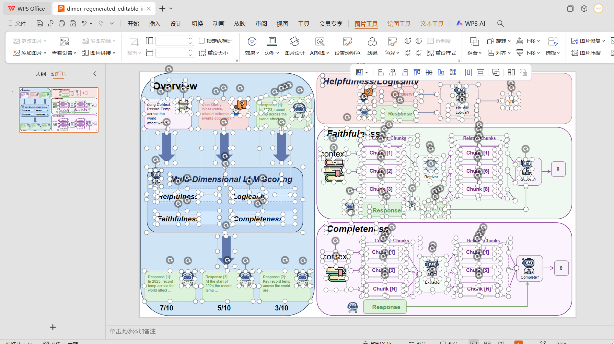
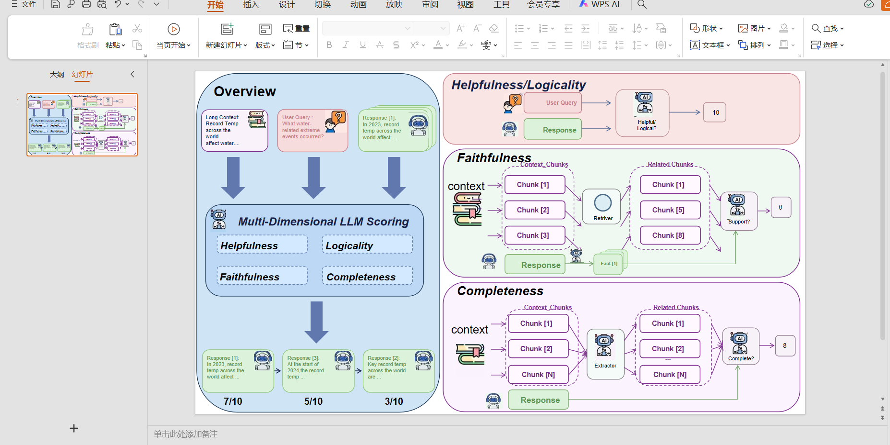
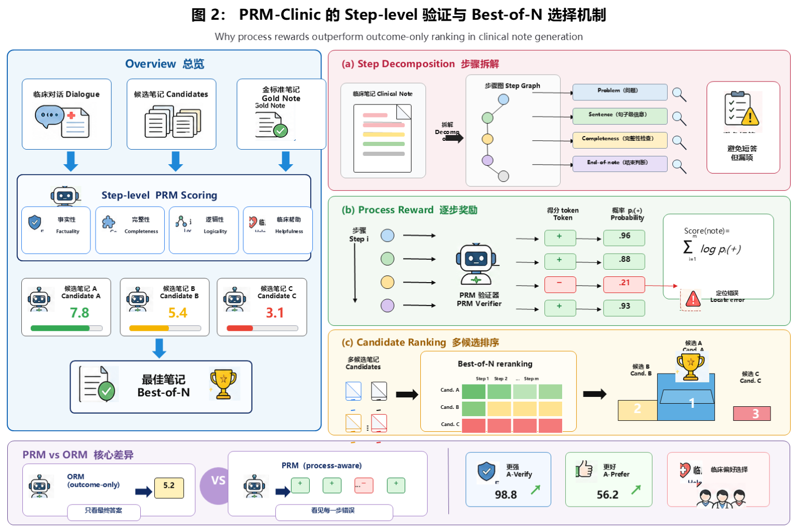
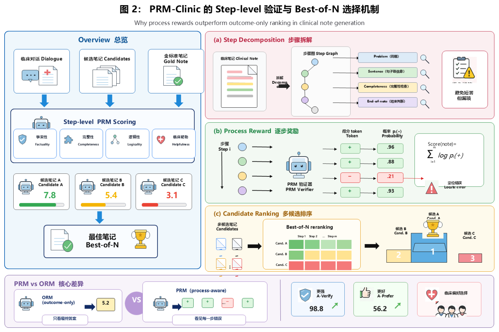

# dimer-ppt

`dimer-ppt` is a Codex skill for converting screenshots, academic figures, and dense infographic images into high-fidelity editable PowerPoint decks.

It is built for the annoying middle ground: figures that are too detailed for a quick manual redraw, but where a full-slide screenshot is not acceptable because the user needs editable text, panels, arrows, tokens, charts, and layout objects.

## What It Does

- Inspects the source and records its regions, text, and styles in a compact `manifest.json`.
- Builds a skeleton first when a dense or uncertain layout benefits from an early geometry check.
- Reconstructs panels, text, arrows, connectors, charts, tokens, and labels as native PowerPoint objects.
- Uses reusable native shape components for simple icons and small raster crops for complex artwork whose details would otherwise be lost.
- Exports a PowerPoint-rendered preview and compares it with the source image.
- Runs local QA scripts, ranks region differences, and sends only relevant crops back for visual repair.

## Quality and Usage Budget

The skill has three effort levels. `balanced` is the default; ask for `fast` on a simple diagram or `strict` when close visual matching matters. The editability requirement stays the same across effort levels.

| Effort | Typical input | Review |
| --- | --- | --- |
| `fast` | Sparse flowchart or simple diagram | Build and render, then investigate actual failures. |
| `balanced` | Most screenshots and diagrams | Inspect the full render once; review the highest-ranked problem regions. |
| `strict` | Dense academic figure or close-match request | Skeleton, full QA artifacts, and a region-level audit. |

The region script writes a `review_summary.json` with scores and creates only the top three review tiles by default. These are triage scores, not a pass/fail measure. Use `--all` for a full set of tiles. Scripts run locally; model usage grows when the assistant repeatedly reads full-size images, all crops, or a complete manifest.

## Relationship To Other Skills

This public version is intended to be self-contained and clean-room.

The workflow uses common reconstruction ideas such as manifests, skeleton passes, render diffs, and layout guards. Those are general engineering patterns, not copied private skill content. Before publishing, the skill was checked against local `ppt-master` and `xiaobei-skill-image-to-vba` skill files for long-line exact duplication; no long-line exact duplication was found.

`dimer-ppt` is narrower than a general presentation-generation system: it focuses on image-to-editable-PPT reconstruction and render-based repair.

## Install

Clone this repository into your Codex skills directory:

```powershell
git clone https://github.com/dididimer/dimer-ppt.git "$env:USERPROFILE\.codex\skills\dimer-ppt"
```

Then restart or refresh Codex so the skill list reloads.

## Usage

Ask Codex to use `dimer-ppt`:

```text
请使用 dimer-ppt skill，把这张图转为可编辑 PPT，要求排版和图片一致。
```

For dense academic diagrams, the default mode is usually `hybrid-fidelity`: layout, text, arrows, charts, and panels are editable, while a few complex cartoon icons may remain as small image crops.

To request a lower-cost pass explicitly:

```text
请用 dimer-ppt 的 fast 模式把这张简单流程图转为可编辑 PPT。先做一次渲染和本地检查，只复核确实有问题的区域。
```

## Local Requirements

- Python with [Pillow](https://pillow.readthedocs.io/) for image comparison and crop scripts (`pip install pillow`).
- Editable native icon components require `python-pptx` (`pip install python-pptx`). The opt-in flat-art converter additionally requires `numpy` and `scipy` (`pip install numpy scipy`). Neither tool requires OpenCV, Potrace, or Inkscape.
- Microsoft PowerPoint on Windows for the bundled COM layout guard and render verification. Without a PowerPoint/WPS render, the result is an unverified draft.

## Opt-in Flat Icon Conversion

`scripts/picture_to_freeform.py` replaces selected simple, low-colour picture objects with editable PowerPoint freeforms. It reads the picture's visible crop, preserves its slide position, size, rotation, and z-order, and writes native `p:sp` / `a:custGeom` objects. It is intentionally conservative: photos, gradients, baked-background anti-aliasing, flips/effects, ambiguous diagonal contours, and artwork over the requested colour, shape, or node budget stay as the original picture. The JSON report records every picture as converted or skipped with the reason.

Select objects explicitly by their one-based index across slides, their exact PowerPoint picture name, or an explicit all-picture flag:

```powershell
python scripts/picture_to_freeform.py input.pptx output.pptx --picture-indices 1,4 --max-colors 4 --max-shapes 24 --max-nodes 1200
python scripts/picture_to_freeform.py input.pptx output.pptx --picture-names "small_icon,shield" --report conversion-report.json
python scripts/picture_to_freeform.py input.pptx output.pptx --all-pictures
```

The converter does not quantize a complex image to force a result. If exact flat RGB layers exceed `--max-colors`, or its planned native freeforms or nodes exceed a budget, it preserves that image and states the budget failure in the report. This is intended for flat icon screenshots; complex illustrations are better redrawn from their semantic components or retained as raster crops.

## Editable Native Icon Components

For antialiased screenshot icons, automatic tracing often creates hundreds of fragments. `scripts/native_icon_components.py` instead redraws selected semantic icons as a small, reusable set of native PowerPoint shapes. The current library covers robot, shield, trophy, document and note variants, puzzle, node graph, heart, and warning icons. You select each picture explicitly in a JSON map; the tool keeps its slide box and z-order, and skips cropped or transformed pictures it cannot safely replace.

```powershell
python scripts/native_icon_components.py `
  --input examples/native-icons/before.pptx `
  --output examples/native-icons/after.pptx `
  --map examples/native-icons/map.json `
  --report examples/native-icons/report.json
```

This is an editability choice: native icons are sharp and independently editable, but their decorative details can differ from the source. The included PowerPoint-rendered [before](examples/native-icons/before.png) and [after](examples/native-icons/after.png) example replaces 20 of 23 picture objects; the three remaining crops are more detailed artwork. Both [PPTX files](examples/native-icons/) are included for direct inspection.

### Render a PPTX with PowerPoint on Windows

Use `scripts/render_pptx_windows.ps1` to export every slide through PowerPoint COM. It opens the target read-only and closes only that presentation. If PowerPoint was already running, the script releases its COM reference without quitting the user's application; otherwise it quits the private application instance it created.

```powershell
powershell -ExecutionPolicy Bypass -File scripts/render_pptx_windows.ps1 `
  -Pptx .\styled.pptx -OutDir .\rendered -Width 1672 -Height 941 -TimeoutSeconds 180
```

The timeout has a 45-second minimum because PowerPoint initialization can be slow. Existing PNGs are protected unless `-Overwrite` is supplied. The script prints a JSON summary only after every requested page exists.

## Examples

### PRM-Clinic Pipeline

GPT-generated source figure:



PowerPoint/WPS result after `dimer-ppt` reconstruction:



### Multi-Dimensional LLM Scoring

GPT-generated source figure:



Editable PPT objects selected in WPS:



Rendered PPT/WPS result:



### Native Editable Icon Example

Original PPT render (23 picture objects):



PowerPoint render after explicit native icon replacement (3 picture objects):



Open [before.pptx](examples/native-icons/before.pptx) and [after.pptx](examples/native-icons/after.pptx) to inspect and edit the objects. The [map](examples/native-icons/map.json) and [report](examples/native-icons/report.json) document every replacement.

## Limitations

- Dense figures in `strict` mode can still take time to inspect, render, and repair.
- Very dense figures may still differ from the original in small details such as icon micro-text, exact line spacing, border radius, or tiny alignment offsets.
- Hybrid-fidelity mode may preserve small raster crops for complex illustrations. This improves visual fidelity, but those cropped icons are not fully editable.
- Exact typography depends on local fonts and PowerPoint/WPS rendering behavior.
- Render-based QA works best on Windows with PowerPoint automation available. If render export is blocked, the result should be treated as a draft until the user opens and verifies it.
- This is not a magic OCR/layout engine. For difficult screenshots, the best result often comes from several local repair passes.

## Expected Artifacts

A normal run produces:

- `manifest.json`
- `styled.pptx`
- `styled_preview.png`
- Local XML and layout QA reports where the corresponding tools are available
- `review_summary.json` and up to three region review tiles for a balanced pass

`strict` mode additionally uses a visual spec, skeleton deck and preview, a full source/render review sheet, and a broader region audit. When render export is unavailable, the PPTX is marked as a draft.

## Notes

- PowerPoint may briefly open and close during generation or validation. That is expected: the skill uses PowerPoint as the rendering and layout engine.
- A full-slide source image should not be used as the final answer unless the user explicitly requests a reference-overlay slide.
- If you publish modified versions of this skill, avoid copying private skill text, examples, or scripts whose license is unclear.

